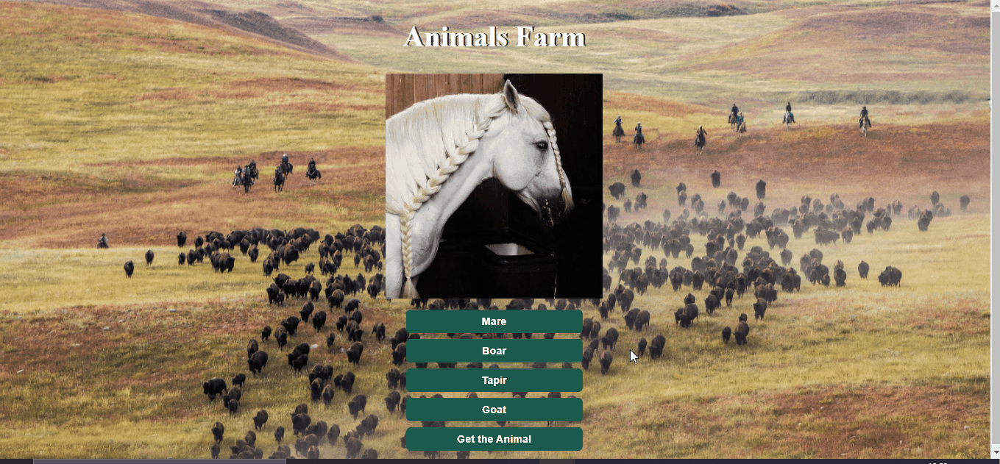

<h1>Animal Selector</h1>

    Animal Selector foi uma ideia que tive para praticar o
    <em>setAtributte, getAtributte</em>. Isso é apenas uma página com animais que são alterados em seus respetivos nomes, e um botão que dá um alerta na página dizendo qual é o animal selecioando.

<h4>
    Segue o Gif mostrando a utilzado do projeto.
</h4>

